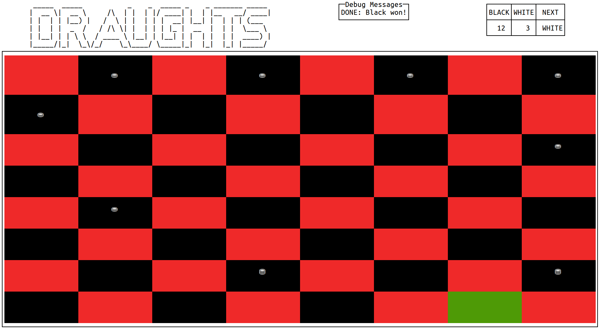

# Draughts

Multiplayer English Draughts (American Checkers) with a Terminal User Interface
(TUI).

## Pre-requisites

Install the [Haskell stack tool](https://github.com/commercialhaskell/stack).

## Installation

```bash
$ make install
```

## Usage

Start the server

```bash
$ server --hostName 127.0.0.1 --portNumber 9120
```

Connect the first client

```bash
$ client --hostName 127.0.0.1 --portNumber 9120 --clientName playerOne
```

Connect the second client

```bash
$ client --hostName 127.0.0.1 --portNumber 9120 --clientName playerTwo
```

Begin playing

## Keybindings

| Key   | Description |
|-------|-------------|
| q     | Quit        |
| Enter | Select      |
| h     | Left        |
| j     | Down        |
| k     | Up          |
| l     | Right       |
| Left  | Left        |
| Down  | Down        |
| Up    | Up          |
| Right | Right       |

## Screenshot



